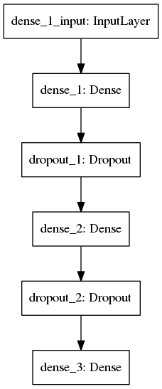

Inspired from https://keras.rstudio.com/


## Installation


```r
devtools::install_github("rstudio/keras")
```

```
## Skipping install of 'keras' from a github remote, the SHA1 (35bd0099) has not changed since last install.
##   Use `force = TRUE` to force installation
```

Keras uses Tensorflow by default. Following lines will install
Keras library with Tensorflow backend:


```r
library(keras)
use_python("/usr/bin/python3")
```

```r
install_keras()
```

```
## Using existing virtualenv at  ~/.virtualenvs/r-tensorflow 
## Upgrading pip ...
## Upgrading wheel ...
## Upgrading setuptools ...
## Installing TensorFlow ...
## 
## Installation complete.
```

```r
library(reticulate)
py_install('pydot', envname = 'r-tensorflow')
```

```
## virtualenv: ~/.virtualenvs/r-tensorflow 
## Upgrading pip ...
## Upgrading wheel ...
## Upgrading setuptools ...
## Installing packages ...
## 
## Installation complete.
```

You might encounter the following error
> ImportError: No module named _internal

This can be resolved by upgradin pip:
`sudo pip install --upgrade pip`
## MNIST problem
MNIST is a dataset of hand-written digits. The objective is to train a
model able to recognize those digits
We'll start by loading the dataset and display some images:


```r
mnist <- dataset_mnist()

par(mfrow=c(2,5)) 
imgs <- sapply(1:10, function (i) {
    image(t(apply(mnist$train$x[i,,], 2, rev)))
})
```


## Data preparation
As usual we split our dataset in train/test set:


```r
x_train <- mnist$train$x
y_train <- mnist$train$y
x_test <- mnist$test$x
y_test <- mnist$test$y
```

Images have size 28x28, so we will first flatten the image to have r`28x28` length vector


```r
## reshape
x_train <- array_reshape(x_train, c(nrow(x_train), 784))
x_test <- array_reshape(x_test, c(nrow(x_test), 784))
```

Next we need to *one-hot encode* the labels:


```r
y_train <- to_categorical(y_train, 10)
y_test <- to_categorical(y_test, 10)
```

We're now ready to train a model !

## Model definition

We start by reproducing results from https://keras.rstudio.com/:


```r
model <- keras_model_sequential() 
model %>% 
    layer_dense(units = 256, activation = 'relu', input_shape = c(784)) %>% 
    layer_dropout(rate = 0.4) %>% 
    layer_dense(units = 128, activation = 'relu') %>%
    layer_dropout(rate = 0.3) %>%
    layer_dense(units = 10, activation = 'softmax')
```


```python
from keras.utils import plot_model
plot_model(r.model, to_file='model.png')
```


```r

```


Next we compile the model:


```r
model %>% compile(
              loss = 'categorical_crossentropy',
              optimizer = optimizer_rmsprop(),
              metrics = c('accuracy')
          )
```

## Model training
We can now train our model. Doing this with Keras is quite easy, we can call the `fit` function.


```r
history <- model %>% fit(
                         x_train, y_train, 
                         epochs = 30, batch_size = 128, 
                         validation_split = 0.2
                     )
```

After a few minutes, our model is trained.
`fit` method returns statistics about training, we can plot it:


```r
plot(history)
```


Keras also provides functions for model performance evaluation:


```r
model %>% evaluate(x_test, y_test)
```

```
## $loss
## [1] 13.65907
## 
## $acc
## [1] 0.1251
```


Something's wrong... accuracy on [Keras first steps](https://keras.rstudio.com/#training-and-evaluation)
is `0.9807` and we only have an accuracy near `0.85`.
We forgot the normalization step, so let's retrain a model with normalized data and see what happen:


```r
x_train <- x_train / 255
x_test <- x_test / 255

history <- model %>% fit(
                         x_train, y_train, 
                         epochs = 30, batch_size = 128, 
                         validation_split = 0.2
                     )
plot(history)
```


```r
model %>% evaluate(x_test, y_test)
```

```
## $loss
## [1] 0.1030876
## 
## $acc
## [1] 0.9802
```

It looks better, now let's try some models with different architecture.
But first let's create a function that will help us evaluate an architecture:


```r
evaluate_architecture <- function(model) {
    history <- model %>% compile(
                             loss = 'categorical_crossentropy',
                             optimizer = optimizer_rmsprop(),
                             metrics = c('accuracy')) %>%
        fit(x_train, y_train, 
            epochs = 30, batch_size = 128, 
            validation_split = 0.2)
    list(training_plot = plot(history), score = model %>% evaluate(x_test, y_test))
}
```


## Without dropout
Dropout layers helps in reducing overfitting by randomly removing
connections between layers at training time. Let's see what happen
if we remove the dropout layers.


```r
model_without_dropout <- keras_model_sequential() %>% 
    layer_dense(units = 256, activation = 'relu', input_shape = c(784)) %>% 
    layer_dense(units = 128, activation = 'relu') %>%
    layer_dense(units = 10, activation = 'softmax')

evaluate_architecture(model_without_dropout)
```

```
## $training_plot
```


```
## 
## $score
## $score$loss
## [1] 0.1617977
## 
## $score$acc
## [1] 0.9776
```

TODO


```r
model_with_128_cells <- keras_model_sequential()  %>% 
    layer_dense(units = 128, activation = 'relu', input_shape = c(784)) %>% 
    layer_dense(units = 128, activation = 'relu') %>%
    layer_dense(units = 10, activation = 'softmax')

evaluate_architecture(model_with_128_cells)
```

```
## $training_plot
```


```
## 
## $score
## $score$loss
## [1] 0.1584446
## 
## $score$acc
## [1] 0.9792
```

## Size matters ?


```r
model_with_128_cells_1_layer <- keras_model_sequential() %>% 
    layer_dense(units = 128, activation = 'relu', input_shape = c(784)) %>% 
    layer_dense(units = 10, activation = 'softmax')

evaluate_architecture(model_with_128_cells_1_layer)
```

```
## $training_plot
```


```
## 
## $score
## $score$loss
## [1] 0.1137535
## 
## $score$acc
## [1] 0.9776
```

## Try different cells number


```r
results_nb_cells <- lapply(4:10, function (i) {
    model <- keras_model_sequential() %>% 
        layer_dense(units = 2^i, activation = 'relu', input_shape = c(784)) %>% 
        layer_dense(units = 10, activation = 'softmax')
    
    evaluate_architecture(model)[['score']]
    })
```

The results:


```r
results_nb_cells
```

```
## [[1]]
## [[1]]$loss
## [1] 0.1840154
## 
## [[1]]$acc
## [1] 0.9497
## 
## 
## [[2]]
## [[2]]$loss
## [1] 0.1306207
## 
## [[2]]$acc
## [1] 0.9663
## 
## 
## [[3]]
## [[3]]$loss
## [1] 0.1059346
## 
## [[3]]$acc
## [1] 0.9747
## 
## 
## [[4]]
## [[4]]$loss
## [1] 0.1067553
## 
## [[4]]$acc
## [1] 0.9782
## 
## 
## [[5]]
## [[5]]$loss
## [1] 0.1104768
## 
## [[5]]$acc
## [1] 0.9803
## 
## 
## [[6]]
## [[6]]$loss
## [1] 0.1240085
## 
## [[6]]$acc
## [1] 0.981
## 
## 
## [[7]]
## [[7]]$loss
## [1] 0.1239604
## 
## [[7]]$acc
## [1] 0.9826
```

```r
library(ggplot2)
as.dataframe(results_nb_cells)
```

```
## Error in as.dataframe(results_nb_cells): could not find function "as.dataframe"
```

